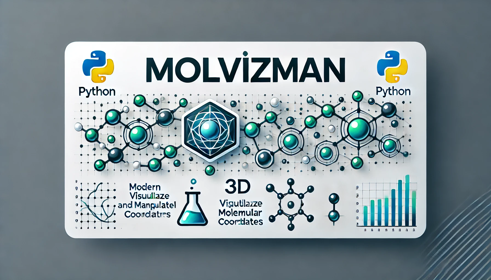

# 🧪 MolMan - Molecular Visualization & Manipulation Tool

**Version 1.0.0** - Production Ready



[](https://github.com/Ajaykhanna/MolMan/actions/workflows/ci.yml)
[](https://github.com/Ajaykhanna/MolMan/actions/workflows/code-quality.yml)
[](https://github.com/Ajaykhanna/MolMan/actions/workflows/security.yml)
[](https://www.python.org/downloads/)
[](https://opensource.org/licenses/MIT)

A professional-grade molecular visualization and manipulation tool with comprehensive testing, logging, state persistence, and automated CI/CD. Built for computational chemists and researchers who need reliable, production-ready software.

🌐 **[Live Demo](https://molman.streamlit.app/)** | 📚 **[Documentation](./docs/)** | 🐛 **[Issue Tracker](https://github.com/Ajaykhanna/MolMan/issues)**

---

## 🌟 Highlights

**MolMan v1.0** is production-ready with:

- ✅ **134 Comprehensive Tests** - 81% code coverage across Python 3.9-3.12
- 🔐 **Security Hardened** - Bandit, Safety, CodeQL scanning
- 📊 **Advanced Logging** - Rotating file handlers with debug mode
- 💾 **State Persistence** - Save/load projects in `.molman` format
- ⚙️ **Configuration Management** - User preferences with recent files tracking
- 🚀 **CI/CD Pipeline** - Automated testing, security scanning, performance monitoring
- 🔧 **Developer Tools** - Pre-commit hooks, code quality checks, type checking

---

## 🎯 Key Features

### Molecular Visualization
- **Multiple Format Support**: XYZ files (with more formats planned)
- **3D Interactive Visualization**: Rotate, zoom, pan with Matplotlib
- **Smart Bond Detection**: Automatic bond identification with customizable criteria
- **Multi-Molecule Systems**: Handle complex systems with multiple molecules
- **Color-Coded Display**: Unique colors for each molecule

### Transformation & Manipulation
- **Translation Controls**: Move molecules along X, Y, Z axes
- **Rotation Controls**: Rotate molecules around any axis
- **Selective Modification**: Choose which molecules to transform
- **Real-Time Preview**: See changes as you make them
- **Undo/Reset**: Restore original configurations

### Project Management
- **Save/Load Projects**: `.molman` format preserves all transformations
- **Auto-Save**: Configurable automatic project saving
- **Recent Files**: Track last 10 opened projects
- **Export Options**: Export to XYZ format
- **Backup Creation**: Automatic timestamped backups

### Production Features
- **Comprehensive Error Handling**: 14 custom exception types
- **Structured Logging**: Debug, info, warning, error levels with rotation
- **User Configuration**: Persistent preferences in `~/.molman/config.json`
- **Performance Monitoring**: Benchmark tracking and regression detection
- **Security Scanning**: Regular vulnerability checks

---

## 📦 Installation

### Quick Start

```bash
# Install from source
git clone https://github.com/Ajaykhanna/MolMan.git
cd MolMan
pip install -e .
```

### Development Installation

```bash
# Install with development dependencies
pip install -e '.[dev]'

# Set up pre-commit hooks
pre-commit install
```

### Requirements

- **Python**: 3.9, 3.10, 3.11, or 3.12
- **Core Dependencies**: NumPy, Matplotlib
- **Optional**: pytest, black, ruff, mypy (for development)

---

## 🚀 Quick Start

### Basic Usage

```python
from molvis_core import io as core_io
from molvis_core.molecule import Molecule
from molvis_core.project import Project
from pathlib import Path
import numpy as np

# Load a molecule from XYZ file
symbols, coords = core_io.load_xyz(Path("molecule.xyz"))
molecule = Molecule(
    id=1,
    name="My Molecule",
    symbols=symbols,
    coords=coords,
    bonds=[]
)

# Apply transformations
molecule.final_translation = np.array([5.0, 0.0, 0.0])
molecule.apply_final_transformation()

# Save as project
project = Project(name="My First Project", molecules=[molecule])
project.save(Path("my_project.molman"))

# Load project later
loaded = Project.load(Path("my_project.molman"))
```

### GUI Application

```bash
# Launch Tkinter GUI
python molecule_visualizer.py molecule.xyz --nMolecules 3 --nAtoms 42 17 29

# Or use Streamlit web interface
streamlit run molvis_streamlit/app.py
```

### Command-Line Tools

```bash
# Run tests
pytest -v

# Check code quality
python test_ci_locally.py

# Generate coverage report
pytest --cov=molvis_core --cov-report=html
```

---

## 🏗️ Architecture

### Core Modules

```
molvis_core/
├── __init__.py           # Package initialization
├── geometry.py           # Geometric operations (centroids, rotations, transforms)
├── io.py                 # File I/O (XYZ loading, parsing, formatting)
├── logic.py              # Bond detection and molecular logic
├── molecule.py           # Molecule class with transformation support
├── config.py             # Configuration management
├── project.py            # Project serialization and persistence
├── logging_config.py     # Logging setup and utilities
└── exceptions.py         # Custom exception hierarchy (14 types)

molvis_plotting/          # Matplotlib visualization
molvis_tkinter/           # Tkinter GUI interface
molvis_streamlit/         # Streamlit web interface
```

### Exception Hierarchy

**File I/O Exceptions:**
- `FileNotFoundError`, `EmptyFileError`, `FileFormatError`, `FileParseError`

**Validation Exceptions:**
- `InvalidCoordinatesError`, `AtomCountMismatchError`, `DimensionMismatchError`

**Molecular Exceptions:**
- `InvalidMoleculeError`, `InvalidRotationError`, `InvalidTransformationError`

**Configuration Exceptions:**
- `ConfigurationError`, `InvalidConfigError`, `MissingConfigError`

---

## 🧪 Testing & Quality

### Test Suite

```bash
# Run all tests (134 tests)
pytest -v

# Run with coverage
pytest --cov=molvis_core --cov-report=html

# Run specific test modules
pytest tests/test_config.py tests/test_project.py -v

# Run performance benchmarks
pytest -m performance
```

**Test Coverage:**
- **134 tests** across all modules
- **81% code coverage** (molvis_core)
- **Multi-version testing**: Python 3.9, 3.10, 3.11, 3.12

### Code Quality

```bash
# Run all quality checks
python test_ci_locally.py

# Format code
black molvis_core tests
isort molvis_core tests

# Lint code
ruff check --fix molvis_core tests

# Type check
mypy molvis_core --ignore-missing-imports

# Security scan
bandit -r molvis_core
```

### Pre-commit Hooks

```bash
# Install hooks
pre-commit install

# Run manually
pre-commit run --all-files
```

**Hooks include:**
- Black (formatting)
- isort (import sorting)
- Ruff (linting)
- mypy (type checking)
- Bandit (security)
- File checks (trailing whitespace, EOF, large files)

---

## 📊 Logging & Debugging

### Enable Logging

```python
from molvis_core.logging_config import setup_logging, enable_debug_mode

# Basic logging setup
setup_logging(level=20, enable_console_logging=True)

# Enable debug mode for verbose output
enable_debug_mode()
```

### Log Files

Logs are stored in `~/.molman/logs/`:
- `molman.log` - All application logs (10MB rotation, 5 backups)
- `molman_errors.log` - Error-level logs only

### Debug Features

```python
# Log context decorator
from molvis_core.logging_config import log_context

@log_context("Loading molecule")
def load_molecule(path):
    # Your code here
    pass
```

---

## ⚙️ Configuration

### User Preferences

Configuration stored in `~/.molman/config.json`:

```json
{
  "version": "1.0",
  "preferences": {
    "auto_save": {
      "enabled": true,
      "interval_minutes": 5
    },
    "recent_files": {
      "max_count": 10,
      "files": []
    },
    "logging": {
      "level": "INFO",
      "enable_console": true,
      "enable_file": true
    },
    "rendering": {
      "default_backend": "matplotlib",
      "show_bonds": true,
      "show_atom_labels": false,
      "background_color": "white"
    }
  }
}
```

### Programmatic Access

```python
from molvis_core.config import ConfigManager

config = ConfigManager()
config.load()

# Get values with dot-notation
auto_save = config.get("preferences.auto_save.enabled")

# Set values
config.set("preferences.auto_save.interval_minutes", 10)
config.save()

# Recent files
from pathlib import Path
config.add_recent_file(Path("my_project.molman"))
recent = config.get_recent_files()
```

---

## 💾 Project Files (.molman)

### Save/Load Projects

```python
from molvis_core.project import Project

# Create project
project = Project(
    name="Complex System",
    molecules=[mol1, mol2, mol3],
    metadata={"description": "My research project"}
)

# Save project
project.save(Path("research.molman"))

# Load project
loaded = Project.load(Path("research.molman"))

# Export to XYZ
project.export_xyz(Path("output.xyz"))

# Create backup
backup = project.create_backup(Path("research.molman"))
```

### File Format

`.molman` files are JSON-based with:
- Project metadata (name, version, timestamps)
- Molecule data (symbols, coordinates, transformations)
- Full transformation history
- Custom metadata fields

---

## 🔧 Development

### Setup Development Environment

```bash
# Clone repository
git clone https://github.com/Ajaykhanna/MolMan.git
cd MolMan

# Create virtual environment
python -m venv venv
source venv/bin/activate  # On Windows: venv\Scripts\activate

# Install with dev dependencies
pip install -e '.[dev]'

# Set up pre-commit hooks
pre-commit install
```

### Running Tests

```bash
# Quick test
pytest -v

# With coverage
pytest --cov=molvis_core --cov-report=html
open htmlcov/index.html

# Specific test file
pytest tests/test_config.py -v

# Test markers
pytest -m unit           # Unit tests only
pytest -m integration    # Integration tests
pytest -m performance    # Performance benchmarks
pytest -m "not slow"     # Skip slow tests
```

### Code Quality Workflow

```bash
# 1. Format code
black molvis_core tests
isort molvis_core tests

# 2. Lint and fix
ruff check --fix molvis_core tests

# 3. Type check
mypy molvis_core --ignore-missing-imports

# 4. Security scan
bandit -r molvis_core

# 5. Run tests
pytest -v

# Or run everything at once
python test_ci_locally.py
```

### Creating a Pull Request

1. **Create feature branch:**
   ```bash
   git checkout -b feature/my-feature
   ```

2. **Make changes and test:**
   ```bash
   python test_ci_locally.py
   pre-commit run --all-files
   ```

3. **Commit with descriptive message:**
   ```bash
   git commit -m "Add feature: description"
   ```

4. **Push and create PR:**
   ```bash
   git push origin feature/my-feature
   ```

5. **Wait for CI checks** - All workflows must pass

---

## 🤖 CI/CD Pipeline

### Automated Workflows

**CI - Tests and Coverage:**
- Matrix testing: Python 3.9, 3.10, 3.11, 3.12
- Full test suite (134 tests)
- Code coverage reporting (Codecov)
- HTML coverage artifacts

**Code Quality:**
- Ruff linting
- Black formatting check
- isort import sorting
- mypy type checking
- Radon complexity analysis

**Security Scanning:**
- Bandit code security
- Safety dependency scanning
- CodeQL advanced analysis
- Dependency review (PRs)
- Weekly scheduled scans

**Performance Testing:**
- pytest-benchmark
- Memory profiling
- Regression detection (150% threshold)

### Monitoring

View CI status: **[GitHub Actions](https://github.com/Ajaykhanna/MolMan/actions)**

Download artifacts:
- Coverage HTML reports
- Security scan results
- Benchmark data

---

## 📚 Documentation

- **[CI/CD Guide](./CI_CD_GUIDE.md)** - Complete CI/CD documentation
- **[Testing Guide](./TESTING_CI_CD.md)** - How to test locally
- **[Phase 3 Testing](./TESTING_PHASE3.md)** - Configuration and project testing
- **[Planned Upgrades](./planned_upgrades.md)** - Roadmap and future phases

---

## 🗺️ Roadmap

### ✅ Completed (v1.0)

- **Phase 1**: Testing Infrastructure (81% coverage, 134 tests)
- **Phase 2**: Logging & Error Handling (14 exception types, rotating logs)
- **Phase 3**: Configuration & State Persistence (.molman format)
- **Phase 10**: CI/CD Pipeline (4 workflows, 5 security tools)

### 🔜 Upcoming

- **Phase 4**: Multi-Format File Support (PDB, MOL2, SDF, CIF)
- **Phase 6**: Performance Optimization (large molecules, caching)
- **Phase 9**: Packaging & Distribution (PyPI, Docker, executables)

See [planned_upgrades.md](./planned_upgrades.md) for detailed roadmap.

---

## 🤝 Contributing

Contributions are welcome! Please:

1. **Check existing issues** or create a new one
2. **Fork the repository**
3. **Create a feature branch**
4. **Write tests** for new features
5. **Ensure CI passes** before submitting PR
6. **Follow code style** (Black, Ruff, isort)

See [CONTRIBUTING.md](./CONTRIBUTING.md) for detailed guidelines.

---

## 📄 License

This project is licensed under the **MIT License**. See [LICENSE](LICENSE) for details.

---

## 🙏 Acknowledgments

- **Open-source community** for excellent tools and libraries
- **Computational chemistry community** for inspiration and feedback
- **Contributors** who help improve MolMan

---

## 🛠️ Built With

**Core Technologies:**
- [Python](https://www.python.org/) - Programming language
- [NumPy](https://numpy.org/) - Numerical computing
- [Matplotlib](https://matplotlib.org/) - Visualization

**Testing & Quality:**
- [pytest](https://pytest.org/) - Testing framework
- [pytest-cov](https://pytest-cov.readthedocs.io/) - Coverage reporting
- [Black](https://black.readthedocs.io/) - Code formatting
- [Ruff](https://docs.astral.sh/ruff/) - Fast Python linter
- [mypy](https://mypy.readthedocs.io/) - Static type checking

**Security:**
- [Bandit](https://bandit.readthedocs.io/) - Security linting
- [Safety](https://pyup.io/safety/) - Dependency scanning
- [CodeQL](https://codeql.github.com/) - Semantic code analysis

**CI/CD:**
- [GitHub Actions](https://github.com/features/actions) - Automation platform
- [Codecov](https://codecov.io/) - Coverage reporting
- [pre-commit](https://pre-commit.com/) - Git hook framework

---

## 📊 Project Stats

- **Lines of Code**: ~5,000+ (production code)
- **Test Coverage**: 81% (134 tests)
- **Python Versions**: 3.9, 3.10, 3.11, 3.12
- **Dependencies**: Minimal (NumPy, Matplotlib)
- **CI/CD Workflows**: 4 automated pipelines
- **Security Tools**: 5 scanning tools
- **Documentation**: 2,000+ lines

---

## 📬 Contact & Support

- **Author**: Ajay Khanna
- **GitHub**: [@Ajaykhanna](https://github.com/Ajaykhanna)
- **Issues**: [GitHub Issue Tracker](https://github.com/Ajaykhanna/MolMan/issues)
- **Discussions**: [GitHub Discussions](https://github.com/Ajaykhanna/MolMan/discussions)

---

## ⭐ Star History

If you find MolMan useful, please consider giving it a star! ⭐

---

## 🎉 Version History

### v1.0.0 (2025-11-26) - Production Ready
- ✅ Comprehensive testing infrastructure (134 tests, 81% coverage)
- ✅ Production-grade logging with rotation and debug mode
- ✅ Configuration management and state persistence
- ✅ Full CI/CD pipeline with 4 automated workflows
- ✅ Security hardening with 5 scanning tools
- ✅ Multi-version Python support (3.9-3.12)
- ✅ Developer tools (pre-commit hooks, local testing)
- ✅ Comprehensive documentation

### v0.x - Beta
- Basic molecular visualization
- XYZ file support
- Tkinter GUI interface
- Streamlit web interface

---

*Made with ❤️ for the computational chemistry community*

**[⬆ Back to Top](#-molman---molecular-visualization--manipulation-tool)**
